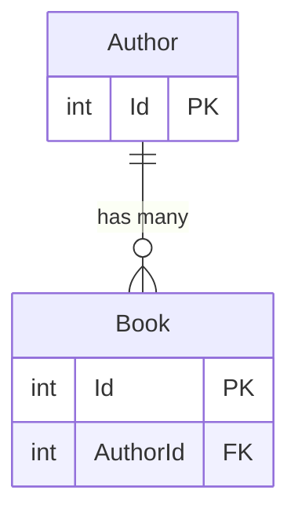
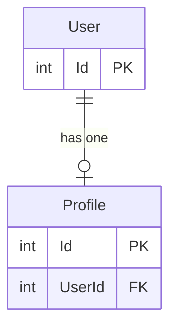
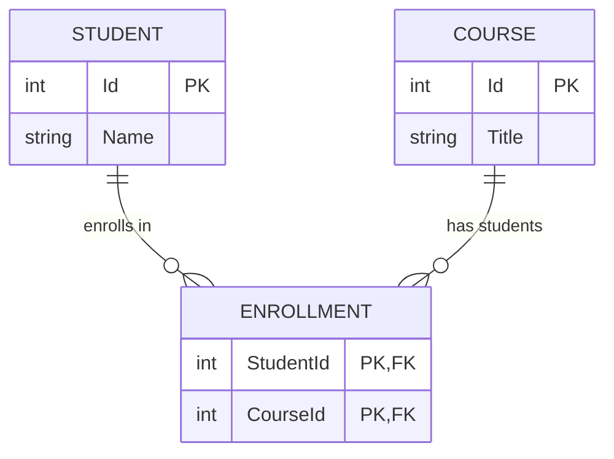

# Read Me

## Goal

Auto generate dataloaders and extensions to match EF core navigations.

## Scenarios

### Generic Data Loader

All entities can be batched loaded directly by primary key

```csharp
// Generic Data Loader
[DataLoader]
internal static async Task<Dictionary<int, Author>> AuthorByIdDataLoader(
    IReadOnlyList<int> ids,
    IDbContextFactory<AppDbContext> factory,
    CancellationToken cancellationToken)
{
    await using var dbContext = await factory.CreateDbContextAsync(cancellationToken);

    var authors = await dbContext.Set<Author>()
        .Where(a => ids.Contains(a.Id))
        .ToListAsync(cancellationToken);

    return authors.ToDictionary(a => a.Id);
}
```

### One to Many



```csharp
public class Author
{
    public int Id { get; set; }
    ...
    public IList<Book> Books { get; set; } = [];
}

public class Book
{
    public int Id { get; set; }
    public Author Author { get; set; }
}

// Author -> Books
[DataLoader]
internal static async Task<ILookup<int, Book>> BooksByAuthorId(
    IReadOnlyList<int> authorIds,
    IDbContextFactory<AppDbContext> factory,
    CancellationToken cancellationToken)
{
    await using var dbContext = await factory.CreateDbContextAsync(cancellationToken);

    var books = await dbContext.Set<Book>()
        .Where(b => authorIds.Contains(b.AuthorId))
        .ToListAsync(cancellationToken);

    return books.ToLookup(b => b.AuthorId);
}

[ExtendObjectType(typeof(Author))]
public sealed class UserExtensions
{
    public async Task<IEnumerable<Book>> GetBooksAsync(
        [Parent] Author parent,
        IBooksByAuthorIdDataLoader dataLoader,
        CancellationToken ct)
    {
        return await dataLoader.LoadAsync(parent.Id, ct);
    }
}
```

### One to One

the only difference between one to one and one to many is that we return a Dictionary instead of a Lookup
as each key can only map to a single entity



```csharp
public class User
{
    public int Id { get; set; }
    ...
    public Profile Profile { get; set; } = default!;
}

public class Profile
{
    public int Id { get; set; }
    ...
    public int UserId { get; set; }
    public User User { get; set; } = default!;
}

[DataLoader]
internal static async Task<Dictionary<int, Profile>> ProfileByUserId(
    IReadOnlyList<int> userIds,
    IDbContextFactory<AppDbContext> factory,
    CancellationToken cancellationToken)
{
    await using var dbContext = await factory.CreateDbContextAsync(cancellationToken);

    var profiles = await dbContext.Profiles
        .Where(p => userIds.Contains(p.UserId))
        .ToListAsync(cancellationToken);

    return profiles.ToDictionary(p => p.UserId);
}

[ExtendObjectType(typeof(User))]
public sealed class UserExtensions
{
    public async Task<IEnumerable<Student>> GetProfileAsync(
        [Parent] User parent,
        IProfileByUserIdDataLoader dataLoader,
        CancellationToken ct)
    {
        return await dataLoader.LoadAsync(parent.Id, ct);
    }
}

// Reuses global data loader
[ExtendObjectType(typeof(Profile))]
public sealed class ProfileExtensions
{
    public async Task<User> GetUserAsync(
        [Parent] Profile parent,
        IUserByIdDataLoader dataLoader,
        CancellationToken ct)
    {
        return await dataLoader.LoadAsync(parent.UserId, ct);
    }
}
```

### Many to Many



```csharp
public class Student
{
    public int Id { get; set; }
    ...
    public ICollection<Enrollment> Enrollments { get; set; } = new List<Enrollment>();
}

public class Course
{
    public int Id { get; set; }
    ...
    public ICollection<Enrollment> Enrollments { get; set; } = new List<Enrollment>();
}

// Join entity (many-to-many)
public class Enrollment
{
    public int StudentId { get; set; }
    public Student Student { get; set; } = default!;
    public int CourseId { get; set; }
    public Course Course { get; set; } = default!;
}

[DataLoader]
internal static async Task<ILookup<int, Course>> CoursesByStudentIdDataLoader(
    IReadOnlyList<int> studentIds,
    IDbContextFactory<AppDbContext> factory,
    CancellationToken cancellationToken)
{
    await using var dbContext = await factory.CreateDbContextAsync(cancellationToken);

    var enrollments = await dbContext.Enrollments
        .Where(e => studentIds.Contains(e.StudentId))
        .Include(e => e.Course)
        .ToListAsync(cancellationToken);

    // Group all enrolled courses by student id
    return enrollments.ToLookup(e => e.StudentId, e => e.Course);
}

[DataLoader]
internal static async Task<ILookup<int, Student>> StudentsByCourseIdDataLoader(
    IReadOnlyList<int> courseIds,
    IDbContextFactory<AppDbContext> factory,
    CancellationToken cancellationToken)
{
    await using var dbContext = await factory.CreateDbContextAsync(cancellationToken);

    var enrollments = await dbContext.Enrollments
        .Where(e => courseIds.Contains(e.CourseId))
        .Include(e => e.Student)
        .ToListAsync(cancellationToken);

    // Group all students by course id
    return enrollments.ToLookup(e => e.CourseId, e => e.Student);
}

[ExtendObjectType(typeof(Student))]
public sealed class StudentExtensions
{
    public async Task<IEnumerable<Course>> GetCoursesAsync(
        [Parent] Student student,
        ICoursesByStudentIdDataLoader dataLoader,
        CancellationToken cancellationToken)
    {
        return await dataLoader.LoadAsync(student.Id, cancellationToken);
    }
}
```

